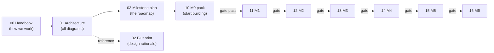

# Benchmark-Surveillance AI Assistant — Junior Handover Package

Complete documentation set for building a TriGraphRAG-based AI assistant for a regulated
finance benchmark-surveillance workflow (Oracle + Gemini + Google ADK). This package is
self-sufficient: the handbook explains the working method, the architecture doc holds all
diagrams, and each milestone has an execution pack with copy-pasteable LLM prompts,
human-only checklists, gate metrics, and independent evaluator prompts.

## Start here

| File | Purpose |
|---|---|
| `docs/00_junior_handbook.md` | **Read first.** The working loop (builder LLM → you → evaluator LLM → PR), prompt discipline, git conventions, escalation, glossary |
| `docs/01_architecture.md` | Full architecture diagram + graph model, ingest & query pipelines, agent topology, state machine, milestone map, Neo4j swap plan |
| `docs/02_trigraphrag_framework_blueprint.md` | Why the design is what it is (incl. the audit of the MedGraphRAG reference code) |
| `docs/03_benchmark_ai_milestone_plan.md` | The roadmap M0–M6 with guardrails and traps |
| `docs/10..16_milestone_N_execution_pack.md` | One pack per milestone — the only doc you *work from* day to day |

## The rules that never bend

1. **One milestone at a time.** The next pack opens only after the current gate review returns PASS and the tech lead signs off.
2. **Builder and evaluator LLMs are separate sessions.** Verdicts get pasted into PRs.
3. **Hard rules from the M0 context header** (single LLM gateway, SELECT-only Oracle, everything audited, no secrets in code, typed graph access, schema-validated LLM output) are never weakened to make a task easier.
4. **Humans own submissions.** AI drafts; a named person edits and submits. The AI never writes to workflow tables.
5. **The golden set is the referee.** Prompt, threshold, model, and architecture changes are admitted by beating it, not by argument.

## Current status

- [ ] M0 in progress — see `docs/10_milestone_0_execution_pack.md`, §7 for the definition of done
- Graph backend: **in-memory mock** (Neo4j pending infra approval — swap plan in `01_architecture.md` §8)
- Oracle access: **named TNS alias**, read-only account
- LLM access: Gemini via the single `LLMClient` gateway (Vertex AI preferred — see M0 H4)
