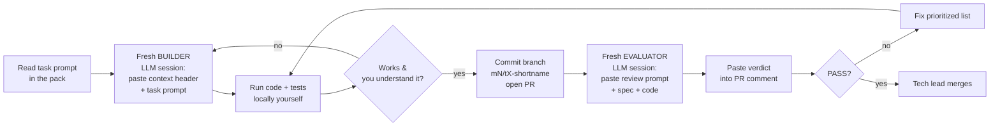

# 00 — Junior Developer Handbook
### How to use this document set to build the Benchmark-Surveillance AI Assistant

Welcome. This folder contains everything you need to build this system milestone by milestone, using an LLM coding assistant as your builder and a second LLM session as your reviewer. Read this handbook first — it explains the working method. **You do not need to invent a plan; you need to execute one, carefully.**

---

## 1. The document set and reading order

| Doc | What it is | When you read it |
|---|---|---|
| `00_junior_handbook.md` | This file — the working method | First, fully |
| `01_architecture.md` | All diagrams: full system architecture, graph model, pipelines, agents | Second — get the picture in your head |
| `02_trigraphrag_framework_blueprint.md` | *Why* the architecture is shaped this way (design rationale, audit of the reference implementation) | Skim now; return when you ask "why can't I just…" |
| `03_benchmark_ai_milestone_plan.md` | The roadmap: milestones M0–M6, guardrails, traps | Your current milestone + one ahead. No further. |
| `10`–`16` `milestone_N_execution_pack.md` | The working documents: objectives, human checklists, **copy-pasteable builder prompts**, gate metrics, evaluator prompts | One at a time, gated |

**The gating rule:** you work exactly one milestone at a time. The next pack is opened only after the current milestone's **gate review** (each pack's final section) returns **GATE PASS** and the tech lead signs off. The packs for M1+ exist in this folder so nothing blocks you organizationally — but reading ahead more than one milestone wastes your time, because later packs assume interfaces the earlier milestones lock in.

---

## 2. The core working loop (memorize this)

Every task (T1, T2, …) in every milestone pack follows the same loop:

**Non-negotiable habits:**

1. **One task per builder session.** Open a fresh LLM chat for each task. Paste the shared context header (M0 pack §3.0) plus that task's prompt. Do not let a session that built T2 also build T3 — context bleed produces subtle coupling.
2. **Builder and evaluator are always separate sessions** (different chat; ideally a different model instance). The evaluator must never see the builder's reasoning — only the spec and the code. Anchored reviewers approve their own mistakes.
3. **You run the code and tests yourself, and you must understand every file you commit.** "The LLM wrote it" is never an acceptable answer in review. If you can't explain a function, ask the builder session to explain it, or ask the tech lead. You are the engineer; the LLM is your typist with opinions.
4. **Evaluator verdicts go into the PR** as a comment, verbatim. In this regulated environment, that trail of independent review is part of our defensibility.
5. **When reality diverges from the pack** (a view doesn't exist, an API behaves differently), you do the workaround AND edit the pack in the same PR. The documents must never lie about what was actually built.
6. **Never weaken a hard rule to make a task easier.** The hard rules (context header: no secrets in code, one LLM gateway, SELECT-only Oracle, everything audited, typed graph access only, schema-validated LLM outputs) exist because of the regulated context. If a rule seems to block you, that's a tech-lead conversation, not a code change.

---

## 3. Prompt discipline

- **Copy prompts exactly**, including the context header. The prompts encode decisions; paraphrasing loses them.
- **Answer the builder's clarifying questions from the pack**, not from imagination. If the pack doesn't answer it, note the question, choose the conservative option, flag it in the PR.
- **Reject scope creep from the LLM.** Builders love adding features. If it's not in the task prompt, it doesn't get committed.
- **When the builder produces something you don't understand, ask it to simplify** — "rewrite this with junior-readable code and comments, no cleverness" is a legitimate and encouraged follow-up.
- **Log costs.** Every milestone has a cost line in its metrics. If the audit summary shows a task burning unexpected money, stop and tell the tech lead.

## 4. Git conventions

- Branch per task: `m1/t3-descriptions`, `m2/t2-sql-tools`.
- PR title = task ID + one line: `M1-T3: AI-assisted table descriptions with review flags`.
- PR body: link to the pack section, list of assumptions made, evaluator verdict pasted as first comment.
- `main` is protected; only the tech lead merges.
- Never commit: `.env`, audit databases, graph snapshots, wallet/TNS files, anything from the H3 restricted list.

## 5. When you're stuck (the escalation ladder)

1. Re-read the task prompt and the relevant blueprint section — the answer is often one paragraph above where you stopped reading.
2. Ask the builder session to debug with you (paste the error verbatim).
3. Search the pack's "traps" and open-questions sections.
4. 30-minute rule: stuck longer than 30 minutes after steps 1–3 → message the tech lead with: what you tried, exact error, your current hypothesis. That message format is mandatory — it's half the debugging.

## 6. Glossary (terms you'll see everywhere)

- **Tier 1 / operational graph** — mutable graph built mechanically from Oracle rows/FKs + extracted comment/attachment content.
- **Tier 2 / source-of-truth documents** — authoritative, versioned policies/regulations/SOPs/designated Confluence pages.
- **Tier 3 / glossary** — controlled vocabulary: data dictionary + business/regulatory term definitions.
- **Meta-graph** — the small per-chunk (or per-breach) subgraph of entities and relations.
- **Golden set** — the versioned Q&A yardstick; every behavior change is judged against it.
- **Gate review** — the evaluator-LLM + tech-lead check that closes a milestone.
- **Domain pack** — config bundle {entity types, tag categories, prompt overrides} that adapts the framework to a vertical.
- **GraphStore contract** — the typed protocol every graph backend must satisfy; the contract tests are what make the in-memory → Neo4j swap safe.
- **Builder / Evaluator** — the two separated LLM roles in the working loop.

## 7. What success looks like

By M5 you will demo a reviewer opening a breach and receiving, in seconds, a draft review pack: the numbers from Oracle, the likely cause with history, the governing policy clause **with a citation that opens the exact document version**, similar past breaches, and open questions — which the human reviewer edits and owns. Every model call along the way logged, every answer explainable. That's the bar. Everything in these documents exists to get you there without shortcuts that would fail an audit.
