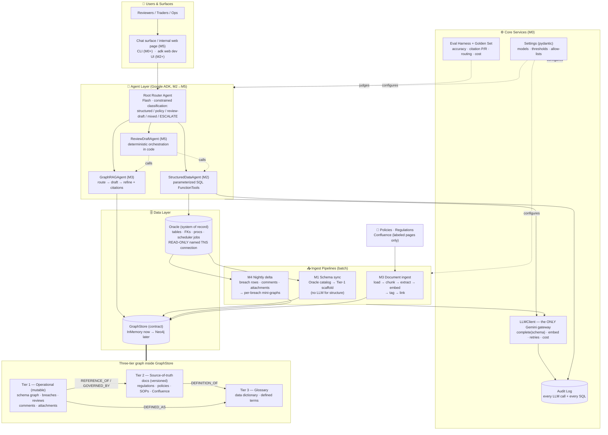
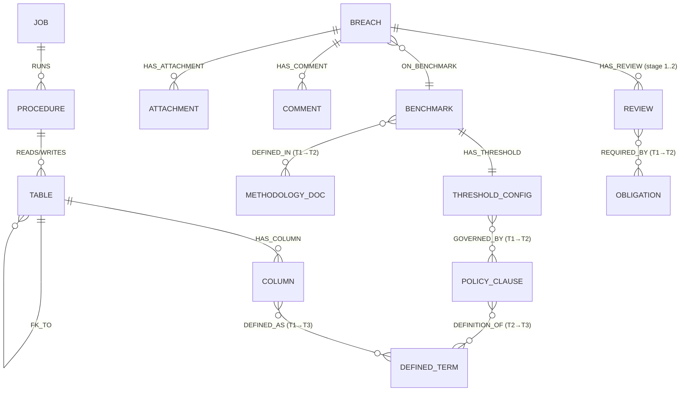
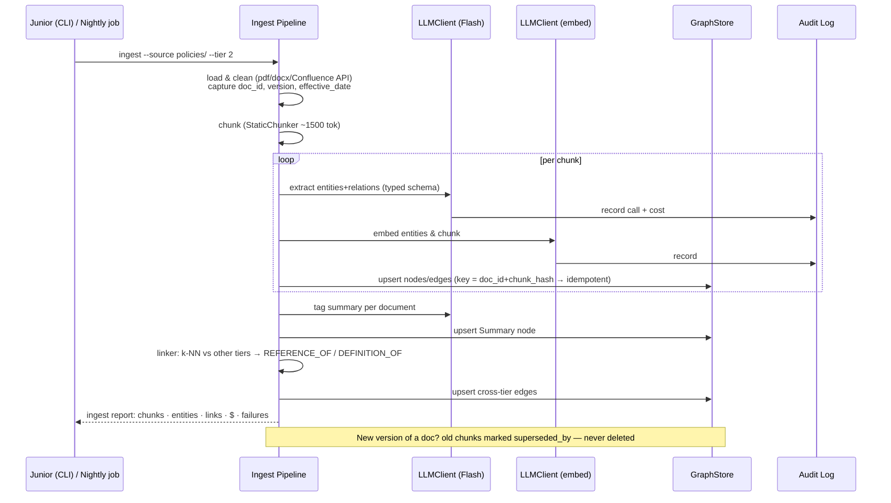
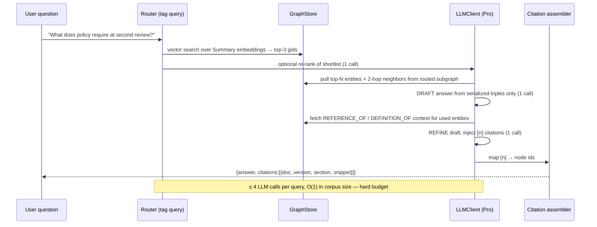
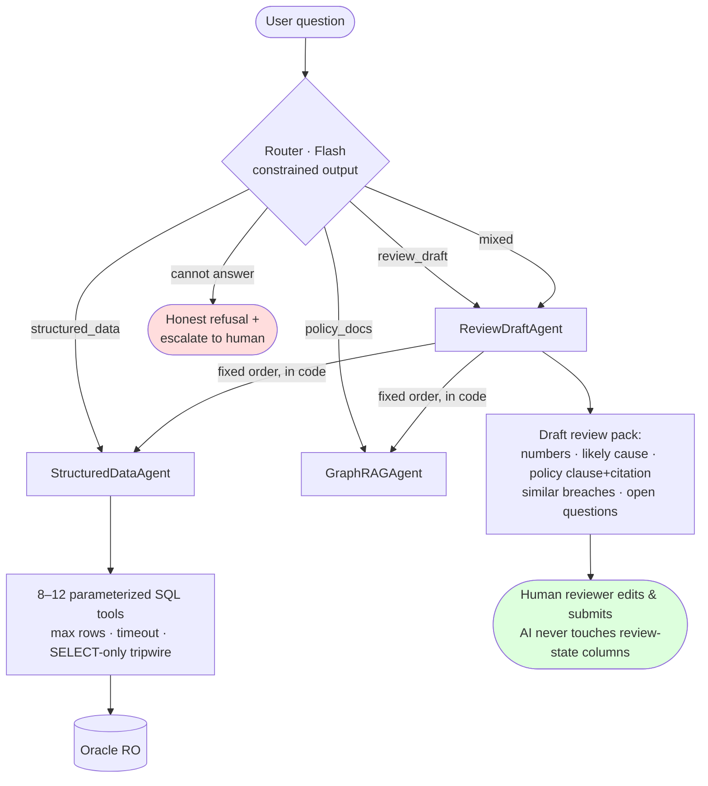
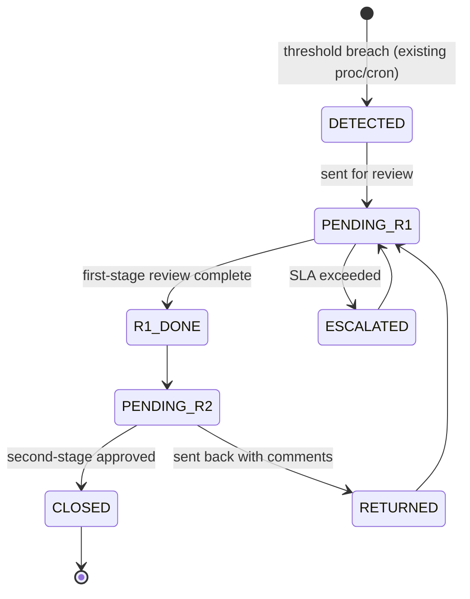
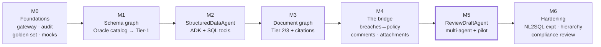
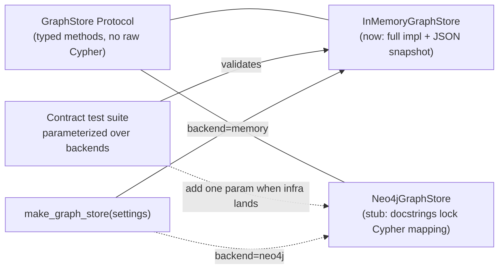

# 01 — System Architecture (Diagrams)

All diagrams are Mermaid — they render directly on GitHub. This document is the visual companion to the blueprint (`02`) and the milestone plan (`03`).

---

## 1. Full architecture — every process on one page

**Cross-cutting invariants:** every model call goes through `LLMClient` → audit log (agents included, via ADK callbacks); Oracle is SELECT-only over allow-listed views; all graph access uses the typed `GraphStore` contract; every answer that cites does so with dereferenceable `{doc, version, section}` citations.

---

## 2. The three-tier graph model

Tier 1 nodes carry `gid` (subgraph id) and live keys from Oracle (`breach_id`, table names). Tier 2 nodes carry `{doc_id, version, effective_date, superseded_by}`. Tier 3 nodes carry `{term, definition, source}`. Cross-tier edges are created by the linker (embedding k-NN above threshold) and, for the critical `GOVERNED_BY` set, **human-approved once** (M4).

---

## 3. Ingest pipeline (M3 documents; M4 reuses the same shape)

---

## 4. Query pipeline — route → draft → refine (GraphRAGAgent)

---

## 5. Agent topology and routing (M5 end-state)

Roster is capped at these three + router. New capabilities enter as *tools*, not agents, unless they beat the incumbent on the golden set. Router accuracy is a harness metric (≥95%).

---

## 6. Review-workflow state machine (model this in M1 — it's where wrong answers hide)

The real state names live in a `REF_STATUS`-style table with history tables behind it — discover and encode the *actual* machine in the schema graph (M1-T7); do not trust this diagram over the database.

---

## 7. Milestone map

Each arrow is a **gate**: artifacts → evaluator gate prompt → tech-lead sign-off. M5 (bold) is the demo that sells the project.

## 8. Swap plan: in-memory graph → Neo4j

The mock is fine through M1 and demo-scale M2; if Neo4j is still unapproved at M3's corpus ingest, escalate — don't scale the mock.
